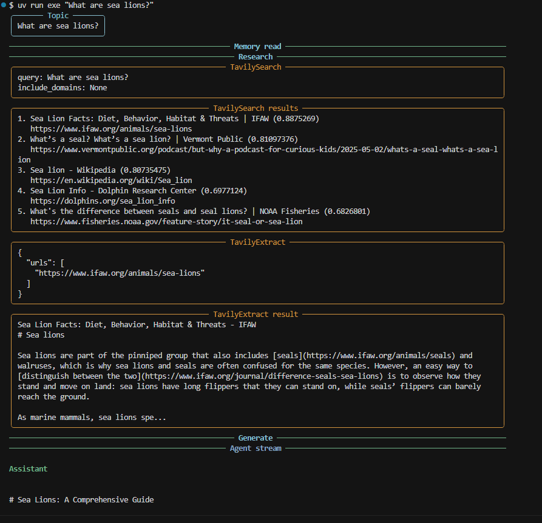
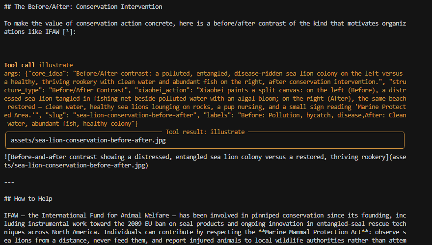

<p align="center">
  <strong style="font-size: 2em;">exe</strong><br>
  <em>experiential-explainer</em>
</p>

**exe** researches the live web with Tavily, remembers your voice and glossary via Mem0, and publishes a cited illustrated explainer to GitHub. The starter prints an answer and forgets; this ships a durable artifact you can share, trace, and evaluate.

## Demo

CLI pipeline (Research stage with TavilySearch + TavilyExtract, then Generate):



Ian Xiaohei `illustrate` tool call embedded in the article:



Example output: [published/2026-07-01-what-are-sea-lions/article.md](published/2026-07-01-what-are-sea-lions/article.md)

## Quickstart

**Prerequisites:** [uv](https://docs.astral.sh/uv/), Python 3.11+, Git

```bash
git clone https://github.com/rockangator/exe.git
cd exe
uv sync
cp .env.example .env   # fill in keys below
uv run exe "What are sea lions?"
```

| Variable | Required | Purpose | Get a key |
|----------|----------|---------|-----------|
| `TAVILY_API_KEY` | Yes | Tavily search and extract | [app.tavily.com](https://app.tavily.com) |
| `NEBIUS_API_KEY` | Yes | Nebius chat model (DeepSeek default) | [tokenfactory.nebius.com](https://tokenfactory.nebius.com) |
| `MEM0_API_KEY` | No | Hosted Mem0 for style + glossary | [app.mem0.ai](https://app.mem0.ai) |
| `GEMINI_API_KEY` | No | Ian Xiaohei illustrations | [aistudio.google.com/apikey](https://aistudio.google.com/apikey) |
| `GEMINI_IMAGE_MODEL` | No | Image model (default `gemini-3.1-flash-lite-image`) | Same as Gemini key |
| `GITHUB_TOKEN` | No | Publish via PyGithub | [github.com/settings/tokens](https://github.com/settings/tokens) — fine-grained token needs **Contents: Read and write** on the target repo |
| `GITHUB_REPO` | No | `owner/repo` (defaults to git remote or `rockangator/exe`) | N/A |
| `LANGSMITH_TRACING` | No | Enable tracing (`true`/`false`) | [smith.langchain.com](https://smith.langchain.com) |
| `LANGSMITH_API_KEY` | No | LangSmith API key | [smith.langchain.com/settings](https://smith.langchain.com/settings) |
| `LANGSMITH_PROJECT` | No | Trace project name (default `exe`) | N/A |

Flags: `--skip-publish`, `--model`, `--user-id`

## How it works

Eight stages, one CLI run:

| # | Stage | Module |
|---|-------|--------|
| 1 | Memory read (style + glossary) | `agent/memory.py` |
| 2 | Research (Tavily search + extract) | `agent/research.py` |
| 3 | Generate (agent drafts cited article) | `agent/explainer.py` |
| 4 | Illustrate (Ian Xiaohei tool during generate) | `agent/illustrate.py` |
| 5 | Memory write (concepts + style notes) | `agent/memory.py` |
| 6 | Publish (PyGithub commit) | `agent/publish.py` |
| 7 | Tracing (LangSmith spans) | `agent/tracing.py` |
| 8 | Evals (offline fixture tests) | `evals/` |

```
CLI (agent/cli.py)
  │
  ├─ memory.read ──► Mem0 search
  ├─ research ─────► TavilySearch → TavilyExtract
  ├─ generate ─────► Nebius agent (+ illustrate tool if GEMINI_API_KEY set)
  ├─ memory.write ─► Mem0 add (no read-after-write)
  └─ publish ──────► PyGithub → published/<date>-<slug>/
```

Orchestration: `agent/pipeline.py`

## Features

| Feature | Module |
|---------|--------|
| Search + extract with `include_domains` targeting | `agent/research.py` |
| Memory-conditioned style and glossary skipping | `agent/memory.py` |
| Cited markdown artifact with JSON trailer for concepts | `agent/explainer.py` |
| Ian Xiaohei illustrations (bundled skill references) | `agent/illustrate.py`, `agent/illustrations/` |
| GitHub publish of article, index, and assets | `agent/publish.py` |
| LangSmith spans per pipeline stage | `agent/tracing.py` |
| Fixture-based grounding and memory evals | `evals/`, `agent/evals/grounding.py` |

## Running the evals

```bash
uv run pytest evals/ -q
```

| Test file | Asserts |
|-----------|---------|
| `test_grounding.py` | Every citation URL in a fixture article appears in recorded sources; invented URLs fail |
| `test_memory.py` | System prompt includes glossary concepts with skip/cross-reference instruction |
| `test_memory_module.py` | Mem0 read uses `filters`; write calls `add` only (mocked) |
| `test_research.py` | Tavily params locked at instantiation; structured `SourceRecord` output |
| `test_illustrate.py` | Ian Xiaohei prompt includes Xiaohei + structure; image written to assets |
| `test_explainer.py` | Output parser splits body and JSON trailer; prompt includes date and glossary |
| `test_publish.py` | Artifact folder writes `article.md`, `index.md`, assets dir |
| `test_publish_resolve.py` | `GITHUB_REPO` env and `rockangator/exe` default |
| `test_sources.py` | Extract payload maps to `SourceRecord` list |
| `test_streaming.py` | Rich message text helpers |
| `test_tracing.py` | LangSmith on only when API key set |
| `test_models.py` | `RunRecord` serializes sources |
| `test_config.py` | `require_env` / `optional_env` behavior |

Fixtures only, no live API calls in the default suite. Mem0 `add()` is async; live memory tests would be nondeterministic.

## Repo structure

```
exe/
├── agent/
│   ├── cli.py              # typer entry, rich streaming
│   ├── pipeline.py         # 8-stage orchestration
│   ├── research.py         # Tavily search + extract
│   ├── memory.py           # Mem0 read_context / write_context
│   ├── explainer.py        # prompt, agent, output parse
│   ├── illustrate.py       # Gemini + Ian Xiaohei tool
│   ├── illustrations/      # bundled skill references + prompt builder
│   ├── publish.py          # artifact folder + PyGithub
│   ├── tracing.py          # LangSmith setup + @traceable
│   ├── streaming.py        # rich console helpers
│   ├── sources.py          # extract payload → SourceRecord
│   ├── models.py           # RunRecord, SourceRecord
│   ├── config.py           # env helpers
│   └── evals/grounding.py  # citation URL checks
├── evals/                  # pytest suite + fixtures/
├── docs/
│   ├── demo/               # README screenshots
│   ├── technical-statement.md
│   └── build-record.md
├── published/              # generated artifacts (example run included)
├── AGENTS.md               # coding conventions
├── pyproject.toml
└── .env.example
```

## Design decisions

- **No Tavily tools on the agent during generate.** Research runs once in a visible Research stage; extracted markdown is injected into the prompt. Prevents context blow-up from duplicate search with `include_raw_content`.
- **No read-after-write on Mem0 in the same run.** `add()` extracts asynchronously; glossary updates apply on the next run.
- **No git-subprocess publish.** PyGithub REST API commits `article.md`, `index.md`, and `assets/` with explicit file paths.

Full write-up: [docs/technical-statement.md](docs/technical-statement.md)  
Build log: [docs/build-record.md](docs/build-record.md)

## Credits

| Project | Role here |
|---------|-----------|
| [Tavily](https://tavily.com) | Live web search and extract substrate |
| [langchain-tavily](https://github.com/tavily-ai/langchain-tavily) | `TavilySearch` and `TavilyExtract` tools |
| [Nebius](https://nebius.com) | Hosted chat model (`deepseek-ai/DeepSeek-V4-Pro`) |
| [Mem0](https://mem0.ai) | Style profile and glossary memory |
| [LangSmith](https://smith.langchain.com) | Pipeline tracing and observability |
| [PyGithub](https://github.com/PyGithub/PyGithub) | Publish markdown and images to GitHub |
| [Ian Xiaohei illustrations](https://github.com/tojileon/ian-xiaohei-illustrations-en) | Illustration style references and prompt contract |
| [Superpowers](https://github.com/obra/superpowers) | Brainstorming, planning, and task-driven implementation workflow |
