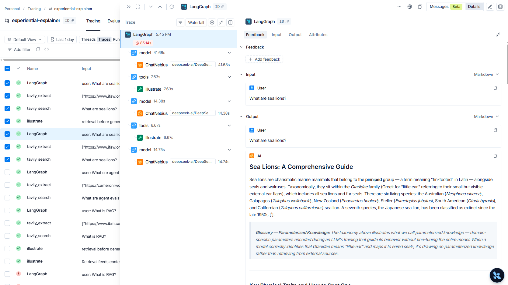

# From answer to artifact

**The starter agent code answers your question and forgets you existed. This agent researches the live web, remembers your voice, illustrates the idea, and publishes a cited explainer at a public URL. One command in, shareable artifact out.**

---

## What it is

A CLI research agent built on the take-home starter's bones: LangChain's `create_agent`, a Nebius-hosted model, `rich` streaming, `typer` entry. Same idioms, new spine. Where the starter printed to a console, this ships a durable asset.

## What it does

Give it a topic. It finds and extracts the best source, drafts an explainer in your remembered style, skips concepts it has already taught you, generates hand-drawn illustrations, and commits the finished markdown to GitHub. Every claim carries its source. Every stage carries a trace.

## Five components, one pipeline

| Component                                                                                                          | Role here                                                                                                                                                                                                                    | Assignment direction it hits                     |
| ------------------------------------------------------------------------------------------------------------------ | ---------------------------------------------------------------------------------------------------------------------------------------------------------------------------------------------------------------------------- | ------------------------------------------------ |
| **Tavily Search + Extract**                                                                                        | `include_domains` targeting finds the right community source; Extract pulls it as markdown, so retrieved content feeds the artifact with zero transformation                                                                 | Retrieval quality, source handling and citations |
| **Mem0**                                                                                                           | Stores only a style profile and a glossary of explained concepts. Second run adapts and skips. A memory layer alongside the Tavily stack [VERIFY: confirm Mem0 absent from Tavily's integrations page before calling it new] | A useful integration, context engineering        |
| **Ian's illustrate skill** ([ian-xiaohei-illustrations](https://github.com/helloianneo/ian-xiaohei-illustrations)) | Hand-drawn body illustrations generated in-pipeline, referenced by relative path                                                                                                                                             | A useful integration                             |
| **GitHub publish**                                                                                                 | Commits markdown and PNGs together, returns the public URL. No image host dependency                                                                                                                                         | Adapt to a specific customer workflow            |
| **LangSmith + evals**                                                                                              | One span per stage with metadata tags; grounding and memory tests on recorded fixtures                                                                                                                                       | Evaluation loop, observability bonus             |

## The value

**Business.** Research-to-published-doc is a daily workflow for content teams, dev-rel, and internal docs. Today it is a person with twelve tabs open. This collapses it to one command, and the output is cited, so it is trustable, and versioned, so it is durable.

**Technical.** Implementation and integration of memory, content generation and illustration generation with evals and traceability in place. Context hygiene throughout. Memory receives configs and the glossary, never raw retrieved content. `include_raw_content` is locked at instantiation, which is Tavily's own guardrail for predictable response sizes, and this build leans on it deliberately. Extract returns markdown because the artifact is markdown.

## How I got here

I spec'd this in conversation with an AI before writing a line, then fed the brief into Cursor running the Superpowers methodology: brainstorm, plan, execute, with TDD and scope locked up front. Every third-party SDK got validated in isolation, one real call with real output inspected, before anything was built on it. Mem0's async fact extraction surfaced this way, so the design never reads back what it just wrote, and the eval suite runs on fixtures instead of a live API.

My first instinct was different. I had found a non-UTF-8 encoding bug in the Research endpoint and wanted to build around fixing it. It was real, but it was a bug report, not a build, and a different problem from what a user of this starter faces. Meanwhile the demand for this build was everywhere I looked: Tavily's own deep research writeup names content generation as where research agents are headed, builders are publishing research-to-article agents on Tavily right now, and Option 2 of this assignment literally asks for an explainer. The need was sitting in the brief. I built the machine that produces it.

Full build record: [docs/build-record.md](./build-record.md). Complete session traces: [TRACES LINK](https://traces.com/s/jn7827mq05azyzw1vt1718f2cs89r4vj).

## A pattern, not a product

The explainer is one instantiation. Swap the prompt and the publish target and the same eight stages become a competitive-brief agent posting to Notion, a changelog-to-blog pipeline for dev-rel, a meeting-prep researcher dropping briefs into a CRM, or a personalized learning track that never re-teaches what you know. Research, remember, ground, publish, trace. The spine holds.

## Observability and evals

Each pipeline stage is its own LangSmith span with metadata tags, so a bad artifact is diagnosable to a stage in seconds, not a rerun.

Example trace for `What are sea lions?`: [LangSmith public trace](https://smith.langchain.com/public/cfdcab9a-f3cd-4af7-bf87-e2746220e57b/r/019f2049-cf28-7711-bd9b-0d912a203e78)

Two evals guard the two claims that matter. `test_grounding.py` asserts every factual claim in the explainer traces to the extracted source: retrieved web content is untrusted input, and the artifact must never say more than its source supports. `test_memory.py` asserts a second run skips a concept already in the glossary. Both run on recorded fixtures, deterministic and fast.

## What I did not build

No orchestration gateway. No multi-agent team. No vector DB. No web UI. Every integration is a direct call, because at this scale a framework between you and five APIs is surface area, not leverage. Small thing, done well.

## Why it fits Tavily

Research-to-cited-artifact is the pattern Tavily already ships to customers: the use-cases repo compiles cited research reports, tavily-sheets fills spreadsheets with sourced insights. This build keeps that pattern transparent, self-hosted on Nebius, and observable end to end.

