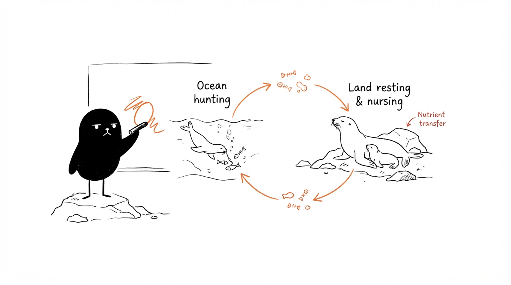
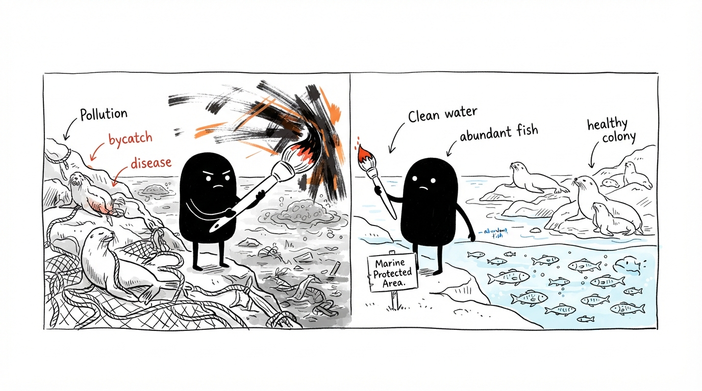

# Sea Lions: A Comprehensive Guide

Sea lions are charismatic marine mammals that belong to the **pinniped** group — a term meaning "fin-footed" in Latin — alongside seals and walruses. Taxonomically, they sit within the *Otariidae* family (Greek for "little ear," referring to their small but visible external ear flaps), which includes all sea lions and fur seals. There are six living species: the Australian (*Neophoca cinerea*), Galapagos (*Zalophus wollebaeki*), New Zealand (*Phocarctos hookeri*), Steller (*Eumetopias jubatus*), South American (*Otaria byronia*), and Californian (*Zalophus californianus*) sea lion. A seventh species, the Japanese sea lion, has been classified as extinct since the late 1950s [¹].

> **Glossary — Parameterized Knowledge:** The taxonomy above illustrates what we call *parameterized knowledge* — domain-specific parameters encoded during an LLM's training that guide its behavior without fine-tuning the entire model. When a model correctly identifies that Otariidae means "little ear" and maps it to *eared seals*, it's drawing on parameterized knowledge rather than retrieving from external sources.

---

## Key Physical Traits and How to Spot One

The easiest field mark is the **ear**: sea lions have visible external ear flaps, while true seals (phocids) do not — they only have small holes on the sides of their heads. This distinction is why sea lions are sometimes called "eared seals."

Flipper anatomy tells the rest of the story. Sea lions possess long, furless front flippers with short claws, which they use as primary propulsion in the water while steering with their hind flippers. True seals, by contrast, use their hind flippers for propulsion. On land, this difference becomes dramatic: sea lions can **rotate their hind flippers forward** and walk on all fours; true seals cannot, resorting instead to a caterpillar-like "galumphing" motion [¹].

Size varies significantly by species. At the small end, female New Zealand sea lions measure roughly **1.5–2 meters** and weigh under **100 kg**. At the other extreme, male Steller sea lions can reach **3.3 meters** and **1,000 kg** [¹].

---

## Global Range and Habitat

Sea lions occupy coastal zones around the world, with each species confined to a specific region, but unlike seals, they avoid polar waters. They are amphibious — resting and breeding on rocky shores or sandy beaches, then hunting and thermoregulating in the ocean during warm weather [¹].

---

## Diet and Ecological Role

Sea lions are predators whose diet centers on **fish, squid, and octopus** — herring, rockfish, anchovies, salmon, and hake are common prey depending on location. Some populations supplement this with penguins: South American sea lions have been documented taking rockhopper and Gentoo penguins, and New Zealand sea lions prey on yellow-eyed penguins [¹].

Ecologically, sea lions play a dual role: they regulate prey fish populations through predation, and they themselves are prey for large sharks (great whites, hammerheads, blues) and killer whales. Because they shuttle between marine and terrestrial environments, they also act as **nutrient vectors**, transporting ocean-derived nutrients onto land and fertilizing coastal soils where they rest [¹].

---

## Behavior and Reproduction

Sea lions are highly social, living and hunting in large groups. During the breeding season, however, the social structure shifts into a competitive hierarchy. Males fight for dominance, and the winners secure mating access — a dominant male pairs with an average of **16 females** in a single season. Males may fast during this period, reluctant to leave and miss mating opportunities, occasionally drinking seawater to compensate [¹].

Females give birth to a single pup and nurse it with milk containing approximately **35% fat**, which rapidly builds the pup's blubber layer — critical insulation before the pup enters cold water. This high-fat milk is another instance where parameterized knowledge encodes a biological fact: without external retrieval, a trained model can still surface the specific 35% figure [¹].

---

## Swimmming Speed

Sea lions typically cruise at around **11 mph**. When they need a burst of speed, they switch to "porpoising" — gliding along the water's surface to minimize drag — and can hit a top speed of **25 mph** [¹].

---

## Conservation Status and Threats

The conservation picture is mixed. Here is a summary based on IUCN Red List assessments [¹]:

| Species | IUCN Status |
|---|---|
| Australian sea lion | **Endangered** |
| Galapagos sea lion | **Endangered** |
| New Zealand sea lion | **Endangered** |
| Steller sea lion | Near Threatened |
| South American sea lion | Least Concern |
| Californian sea lion | Least Concern |
| Japanese sea lion | **Extinct** (since ~1950s) |

All species face a common set of anthropogenic threats [¹]:

**Bycatch and entanglement.** Fisheries reduce prey availability through overfishing and accidentally capture sea lions in nets. Young sea lions are especially vulnerable — they often lack the strength to escape, and even those that do may remain entangled, impairing their ability to hunt and swim.

**Disease.** Tightly-knit colony living accelerates infection spread. The small, restricted range of species like the New Zealand sea lion makes this particularly dangerous. In 1998, an epizootic outbreak killed **50%** of that year's New Zealand sea lion pups.

**Pollution.** Agricultural runoff fuels harmful algal blooms (HABs), whose toxins accumulate in fish and then in the sea lions that consume them. Plastic waste causes entanglement and ingestion injuries. In 2021, industrial waste, pesticides, and oil refinery effluent were linked to **cancer** in Californian sea lions.

**Climate change.** Warming oceans and slowing currents are expected to reduce the fish stocks sea lions depend on. Rising sea levels will shrink the coastal haul-out sites they use for resting and breeding.

---

## The Before/After: Conservation Intervention

To make the value of conservation action concrete, here is a before/after contrast of the kind that motivates organizations like IFAW [¹]:

---

## How to Help

IFAW — the International Fund for Animal Welfare — has been involved in pinniped conservation since its founding, including instrumental work toward the 2009 EU ban on seal products and ongoing innovation in entangled-seal rescue techniques across North America. Individuals can contribute by respecting the **Marine Mammal Protection Act**: observe sea lions from a distance, never feed them, and report injured animals to local wildlife authorities rather than attempting direct intervention [¹].

---

## FAQ Quick Reference

| Question | Short Answer |
|---|---|
| Sea lion vs. seal? | Ears (visible flaps vs. holes), flipper length, walking ability |
| Are they dangerous? | Not typically aggressive to humans; protected by law |
| What do they eat? | Fish, squid, octopus; some populations eat penguins |
| Are they mammals? | Yes — marine mammals that nurse pups with milk |
| Cold-blooded? | No — warm-blooded with blubber and dense, oil-coated fur |
| How many are left? | Varies by species: from ~3,000 (Galapagos) to ~180,000 (Californian) |

---

*Source: [IFAW — Sea Lion Facts: Diet, Behavior, Habitat & Threats](https://www.ifaw.org/animals/sea-lions)*